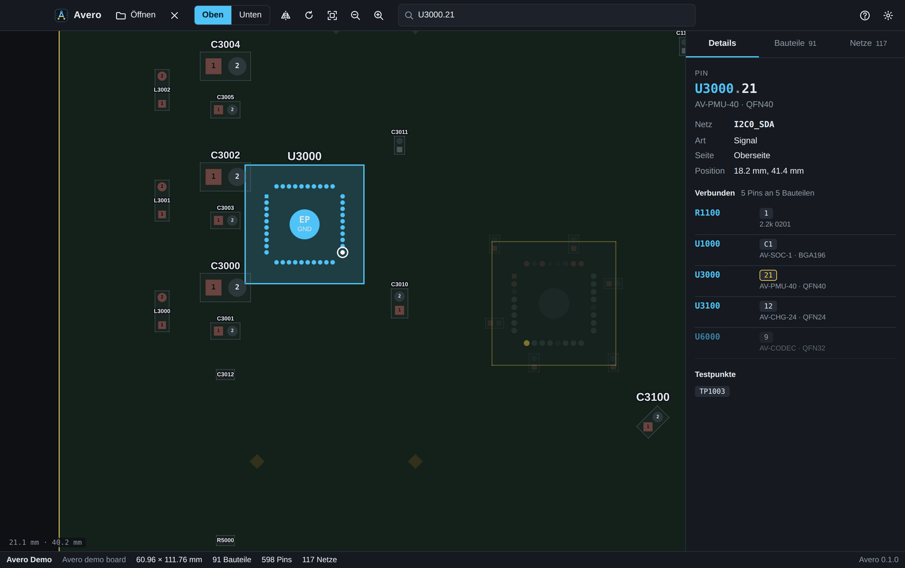

<p align="center">
  
</p>

<h1 align="center">Avero</h1>

<p align="center">Boardview für die Elektronik-Reparatur auf dem Mac.</p>

<p align="center">
  
  
  
</p>



Avero öffnet Boardview-Dateien, findet Bauteile, Pins und Netze und verfolgt ein Signal über beide Seiten der Platine. Das Ziel ist ein Werkzeug auf dem Niveau von FlexBV und XinZhiZao: Boardview, Schaltplan und Werkstattwissen in einer App. Alles läuft lokal, ohne Konto und ohne Telemetrie.

## Stand (0.5)

**Boardview**
- Liest Test_Link `.brd` (auch verschleierte Dateien), BRD2, Honhan `.bdv`, ASUS `.asc` und `.fz`, `.cae`, BoardViewer `.bvr` / BVR3, GenCAD, Panel-CAD, IBM `.cst`, XinZhiZao `.pcb`, KiCad `.kicad_pcb`, EAGLE / Fusion 360 `.brd` (XML) und Altium `.PcbDoc` im Textformat (PCB ASCII).
- Die meisten ASUS-`.fz`- und `.cae`-Dateien sind verschlüsselt: Die Schlüssel trägst du einmal in den Einstellungen ein (Avero liefert sie nicht mit, genau wie OpenBoardView); unverschlüsselte Dateien öffnen sich direkt. XinZhiZao-`.pcb`-Dateien öffnen sich vollständig: Bleiben Bauteile beim direkten Lesen gesperrt, übernimmt der XZZ-Konverter der Bibliothek und liefert alle Bauteile samt Pad-Formen und Leiterbahnen. Ein eigener XZZ-Schlüssel aus den Einstellungen hat Vorrang.
- Flüssige Darstellung per GPU (WebGL 2), auch bei zehntausenden Pins.
- Oberseite / Unterseite (gespiegelt wie ein umgedrehtes Board), Drehen in 90°-Schritten. „Oben“ und „Unten“ schalten sich einzeln: beide an zeigt **beide Seiten zugleich** wie in FlexBV – die Unterseite gespiegelt neben (bei breiten Boards unter) der Oberseite, Verbindungslinien eines Netzes laufen über beide Seiten, Klicks wählen auf der Seite, auf die man klickt.
- Klick auf einen Pin hebt das ganze Netz hervor. Pins desselben Netzes auf der anderen Seite bleiben schwach sichtbar, damit man sieht, wohin das Signal geht.
- Pin 1 ist eckig gezeichnet, Versorgungsnetze rot, Masse dunkel, Testpunkte als Raute. Beim Hineinzoomen zeigt eine **Übersichtskarte** oben rechts das ganze Board mit dem sichtbaren Ausschnitt; ein Klick oder Ziehen darauf springt hin (abschaltbar). Größere Bauteile tragen unter dem Namen ihren Wert bzw. Typ (z. B. „1uF“, „ISL88739A…“), und die Pin-Tabelle eines Bauteils zeigt je Pin den Diodenwert seines Netzes – aus dem aktiven Reparaturfall, der Referenz oder OpenBoardData. Farben nach dem Vorbild von FlexBV: dunkel mit fast schwarzem Board, grauen Bauteilen, großen lila Chip-Namen, das gewählte Netz knallgelb mit weißen Verbindungslinien und gelben Namensschildern an allen Bauteilen des Netzes; hell mit weißem Board, dunklen Umrissen und Magenta statt blassem Gelb.
- Suche nach Bauteil, Netz oder Pin: `U3000`, `PP3V3`, `U3000.21`, `U1000 A12`.
- **Befehlspalette** (`⌘K`): jeder Befehl, jedes Bauteil, Netz und jeder Pin in einer Liste.
- **Verbindungslinien** (Ratsnest) zwischen den Pins des gewählten Netzes, jeweils zum nächsten Nachbarn.
- **Mehrere Netze gleichzeitig** (`P` oder „Anpinnen“ im Netz): jedes angepinnte Netz behält seine eigene Farbe auf Pins, Vias und Leiterbahnen, mit Legende auf dem Board.
- **Markierungen auf dem Board** (`M` oder Fähnchen in der Werkzeugleiste): eine Nadel mit Notiz an jede Stelle setzen, etwa „Kurzschluss gegen Masse hier“; pro Board gespeichert und unter „Messen“ aufgelistet.
- **Schaltplan-Fundstellen**: Zu jedem Bauteil und Netz zeigt das Detailpanel alle Seiten des Schaltplans, auf denen es vorkommt, mit Anzahl; ein Klick springt hin. **Netze umbenennen** (z. B. `Net10` → `GND`), gespeichert pro Board; Messwerte ziehen mit.
- **OpenBoardData:** `.obdata`-Dateien von [openboarddata.org](https://openboarddata.org) (Messwerte bekannt guter Boards, vor allem MacBooks, Lizenz ODbL) lassen sich im Reiter „Wissen“ importieren. Passt die Boardnummer im Dateinamen – oder ordnet man die Daten mit „Diesem Board zuordnen“ zu –, zeigt Avero beim angeklickten Netz Diode, Spannung und Widerstand je Board-Zustand samt Hinweisen und verwandten Netzen, beim Bauteil Wert und Gehäuse. Die Diagnose-Abschnitte der Datei (z. B. Einschaltsequenz) erscheinen als Seite, Netz- und Pinverweise darin sind anklickbar.
- **Chip-Datenbank:** Steht der Bauteiltyp in der Boarddatei (z. B. `ISL88739AHRZ`, `RT6575DGQW`, `NCP303151MNTWG`), zeigt Avero in den Details, was der Chip tut und was sein Datenblatt sagt – Eingangsspannung, Ströme, Gehäuse – mit Link zur Herstellerquelle. Erfasst sind gängige Notebook-Laderegler, Spannungswandler, Leistungsstufen, Lastschalter und Embedded Controller sowie die PD-, Lade- und HDMI-Chips von Switch, PS5 und Xbox; nur Angaben, die beim Hersteller nachgeprüft sind.
- **Daten aus dem Schaltplan**: Ist ein Schaltplan geöffnet, liest Avero aus seinem Text, was neben jedem Bauteil steht – Wert ("10UF" → 10 µF, "4K7" → 4,7 kΩ, "6.8UH"), Nennspannung/-strom, Toleranz, Dielektrikum, Gehäuse, die Teilenummer von Chips ("LT3957") und Hinweise wie CRITICAL oder „nicht bestückt“ (NOSTUFF/DNP), auch aus zusammengesetzten Angaben wie "10U_0603_25V6K" oder "0.1U/10V_4". Ein Wert gehört immer zum nächstgelegenen Bauteilnamen, Text darüber zählt nur direkt in der Zeile darüber – lieber keine Angabe als eine falsche. Die Angaben stehen im Detailpanel unter „Laut Schaltplan“ mit Seitenzahl, der Wert erscheint auf dem Board unter dem Bauteilnamen. Netzspannungen aus Angaben wie "VOLTAGE=3.3V" unter dem Netznamen (Apple) stehen beim Netz und werden in der Fehlersuche als Sollwert „laut Schaltplan“ genommen.
- **Fehlersuche „Notebook geht nicht an“** (Reiter „Fehlersuche“): Schritt für Schritt vom Netzteil-Eingang über Laderegler, Systemspannung, 3V/5V-Dauerspannungen und RTC, EC, Einschalttaste und Intel-Einschaltsequenz (RSMRST#, SLP_S5#/S4#/S3#, VR_ON, VR_PWRGD, PWROK …) bis zu Speicher und Wandlern. Avero sucht die Messpunkte im geöffneten Board selbst – aus geprüften Datenblatt-Pinbelegungen (z. B. ACIN 2–3,5 V am ISL88739A), aus Netznamen, die ihre Spannung nennen (`+3VALW` 3,3 V), und aus den Standard-Signalnamen – und sagt bei jedem Punkt, woher der Sollwert stammt. Die Werte landen im aktiven Reparaturfall; der erste Wert, der nicht passt, wird mit einem Hinweis hervorgehoben.
- **Pinbelegung aus dem Datenblatt:** Für ISL88739A, RT8207P, SY8286, TPS2546, TPS22966, NCP81253, BQ24193 und die onsemi-Leistungsstufen NCP302045/NCP303151 kennt Avero die Pinbelegung samt Sollwerten (z. B. „ACIN: 2–3,5 V = Netzteil gültig“, „VTT = ½ VDDQ“). Angezeigt wird sie erst nach einer Prüfung am jeweiligen Board: Alle Masse-Pins des Datenblatts müssen auf Masse liegen und die Netznamen mehrheitlich zu den Pinnamen passen. Nummeriert eine Boarddatei die Pins anders (zusammengelegte Pads, eigenes Gehäuse), zeigt Avero den Grund statt falscher Beschriftungen.
- **Reparaturwissen** (Reiter „Wissen“): Seiten von repair.wiki (oder einem anderen MediaWiki) importieren – über „Spezial:Exportieren“ als XML oder einzeln im Browser als HTML gesichert. Avero ordnet jede Seite ihrem Gerät zu, zeigt sie beim passenden Board (Seiten mit der Boardnummer zuerst), durchsucht alles und macht Netz- und Bauteilnamen im Text anklickbar. Anleitungen („Repair guide“, „Explanatory guide“) landen über ihr Gerätefeld beim richtigen Gerät, andere Modelle derselben Familie stehen getrennt darunter. Messbilder und Platinenfotos erscheinen als Galerie (Bilder laden direkt von repair.wiki, sonst öffnet ein Klick die Bildseite), Links zu anderen importierten Seiten öffnen in Avero, alle anderen im Browser. Avero bringt außerdem eigene Referenzseiten mit, deren Werte aus den Messbildern von repair.wiki abgelesen sind – USB-C-Diodenwerte von Switch, Switch OLED, Switch Lite, Switch 2, DualSense und Xbox-Controllern (für bis zu sieben Tail-Plug-Tester: Mechanic T824/T824SE, JCID CD01, Qianli iBridge, YCS, 2UUL), HDMI-Diodenwerte von PS5, PS4 Pro/Slim, Xbox Series X/S und One X/S samt Vergleichstabelle, dazu Messwerte und Hinweise zu PS5, PS5 Slim, PS4, Game Boy Advance SP und DS Lite. Dazu kommen geprüfte Angaben aus dem Netz – Ladeelektronik der Switch, HDMI-Chips von PS5 und Xbox – mit Quellenliste; aufgenommen wird nur, was Datenblätter oder mindestens zwei unabhängige Quellen bestätigen, Messwerte von defekten Geräten und widersprüchliche Angaben (z. B. PS4-HDMI-Chips) bleiben draußen. Avero rechnet die Tester-Anzeigen selbst in Pinbelegungen um (Mechanic: 01–12 = A1–A12, 13–24 = B12–B1; HDMI-Adapter). Quelle und Lizenz (repair.wiki: CC BY-SA 3.0) stehen bei jeder Seite, „Original öffnen“ führt zur Wiki-Seite.
- **Ansicht als PDF** (`⌥⌘E`): aktuelle Ansicht mit Legende der angepinnten Netze und Liste der Markierungen.
- **Leiterbahnen und Lagen**, wo die Datei sie enthält (GenCAD `$ROUTES`): jede Lage in eigener Farbe (oben rot, unten blau, Innenlagen bunt), die sichtbare Seite kräftig, Innenlagen und Rückseite schwächer, Vias als Punkte. Im Reiter „Lagen“ lässt sich jede Lage einzeln schalten („Nur oben“, „Nur unten“, „Alle an/aus“). Ein gewähltes Netz leuchtet auf allen Lagen, der Rest tritt zurück; ein Klick auf eine Bahn wählt ihr Netz. Abschaltbar in den Einstellungen. Kennt die Datei von Bauteilen nur Name, Position und Drehung (etwa aus XZZ-Konvertern), **rekonstruiert Avero die Bauteile aus dem Kupfer**: Typ aus dem Gehäusenamen (Kondensator/Widerstand, Spule, Quarz, IC, Stecker) in eigener Farbe, Seite und Pad-Abstand je Bauform aus den Leiterbahn-Enden gelernt, BGA-Größe aus dem Ball-Raster im Namen oder dem Via-Feld darunter. Wo eine Leiterbahn oder ein Via genau auf einem Pad endet, bekommt das Bauteil einen Pin mit Netz. Bei namenlosen Netzen (Net1, Net2 …) erkennt Avero die Masse an ihren Vias, die über die ganze Platine verteilt sind, und markiert das Netz als „Masse?“. Alles Geschätzte ist im Detailpanel als „geschätzt“ markiert.
- **Netze verfolgen** über Spulen, Ferrite, Sicherungen, Jumper und 0-Ω-Widerstände: Das Detailpanel zeigt „Weiter über", z. B. `PP1V8_SW` → `PP1V8` über `L3001`.
- Ansicht als PNG exportieren (`⇧⌘E`), mit allen Beschriftungen.
- **Tabs**: Jedes weitere Board öffnet sich in einem eigenen Tab, mit eigenem Schaltplan, eigener Auswahl und Ansicht. Eine schon offene Datei springt zu ihrem Tab.
- **Zwei Boards vergleichen** (Darstellung → „Mit anderem Tab vergleichen"): das Board eines anderen Tabs daneben, Auswahl nach Namen gespiegelt – Bauteil, Pin und Netz werden auf beiden Boards gezeigt, etwa bei zwei Revisionen.
- Detailpanel mit Wert, Seite, Position und allen verbundenen Bauteilen und Pins, dazu Listen aller Bauteile und Netze.

**Schaltplan**
- PDF-Schaltplan neben dem Board, mit verschiebbarem Trenner; ein PDF im selben Ordner wie die Boardview-Datei öffnet sich automatisch (gleicher Name oder gleiche Boardnummer wie `820-02100`).
- Bauteil, Pin oder Netz im Board wählen → der Schaltplan springt zur Fundstelle und markiert alle Vorkommen; mit `[` / `]` durch die Fundstellen.
- Bauteil- oder Netznamen im Schaltplan anklicken → das Board zeigt sie.
- Scharf bei jeder Zoomstufe, Seitennavigation und Lesezeichen (Abschnitte) des PDFs.
- **Freie Textsuche** im Schaltplan (`⌥⌘F`): findet auch Wortteile, z. B. `VBUS` in `PP_VBUS`; `↩` / `⇧↩` springen durch die Treffer.
- **Eigenes Fenster** für den zweiten Monitor: Der Schaltplan folgt weiter der Auswahl im Board, Klicks im Schaltplan wählen im Board aus.

**Werkstatt**
- **XZZ-Konverter direkt in der Bibliothek:** Mit „XZZ-Dateien auswählen…“ und ⌘/Umschalt mehrere `.pcb`-Dateien auswählen oder über „Ordner konvertieren…“ einen ganzen Ordner inklusive Unterordnern verarbeiten. Avero konvertiert zwei Dateien gleichzeitig in GenCAD, übernimmt Dateinamen und Netzverbindungen und speichert die `.cad`-Dateien im Bibliotheksordner. Optional gilt die beim Import gewählte Kategorie. Bereits vorhandene Ergebnisse werden übersprungen, andere Dateien nie überschrieben. Fortschrittsbalken, Fehler pro Datei und „Board öffnen“ erscheinen direkt im Fenster. „Nach aktuellen Dateien stoppen“ beendet die Warteschlange, sobald die laufenden Dateien gespeichert sind. Erfolgreiche Ergebnisse bleiben auch bei einem Fehler erhalten. Keine Terminalbefehle, keine Ausgabe-Dateinamen und kein zusätzliches Programm. Die Konvertierung nutzt einen kompatiblen Standardschlüssel; ein eigener XZZ-Schlüssel aus den Einstellungen hat Vorrang.
- **Konsolen-Sammlung importieren:** In der Bibliothek „Konsolen-Sammlung importieren…“ anklicken und das heruntergeladene `Konsolen_Schaltplaene_und_Boardviews_2026-10-01.zip` auswählen. Avero prüft die Prüfsummen des Sammlungsmanifests, übernimmt Boardviews und PDFs in Marke › Gerät › Modell und wandelt XZZ direkt in GenCAD um. Rekonstruierte Layouts sind entsprechend bezeichnet. Das getestete Paket ergibt **20 Boards und 75 PDFs**, darunter sechs konvertierte Switch-Boards. Alternative entschlüsselte Fassungen desselben OLED-Boards werden ausgelassen. Ein erneuter Import überspringt bereits vorhandene Dateien, auch nach einer Umbenennung. Projektquellen, Bilder und Lizenzen bleiben im ursprünglichen ZIP. Die Sammlung wird vom eigenen ZIP importiert und ist kein Bestandteil des App-Downloads.
- **Bibliothek** (`⌘L`): eigene Avero-Bibliothek unter `~/Dokumente/Avero/Bibliothek`. Dateien, Ordner oder ZIP-, 7z- und RAR-Archive ins Bibliotheksfenster ziehen oder „Importieren…" – Avero kopiert Boardviews und Schaltpläne hinein, sortiert sie nach Boardnummer oder in einen Geräteordner deiner Wahl (`Apple/iPhone 13 Pro`) und überspringt Duplikate. Nach dem Import – und jederzeit über den Stift an jedem Eintrag – lassen sich die Dateien umbenennen, etwa `download (3).pdf` in `J413 820-02100.pdf`. Über den Papierkorb an jedem Eintrag wandert ein Board samt Schaltplänen nach Rückfrage in den macOS-Papierkorb (nur Dateien der eigenen Bibliothek; eingebundene Ordner bleiben unberührt). **Marken und Geräte:** Links steht ein Baum Marke › Gerät › Modell (z. B. Sony › PlayStation › PS4, Nintendo › Switch › Switch Lite) mit Anzahl je Ebene; ein Klick filtert. **Automatisch eingeordnet:** Neue Dateien landen ohne weiteres Zutun im passenden Ordner – Avero erkennt das Gerät an Board- und Modellnummern (PS5 `EDM-020`/`CFI-1216A` → Sony › PlayStation › 5, Switch OLED `HEG-CPU-01` → Nintendo › Switch › OLED, `SM-A515F` → Samsung › Galaxy A › A515F, MacBook über `A2338` oder `820-…`, ThinkPad, Latitude, EliteBook, ASUS-, Acer- und MSI-Modellcodes, Grafikkarten) und liest notfalls den Text des Schaltplans. Abschaltbar unter dem Import-Knopf; „Einordnen…“ sortiert Vorhandenes mit Vorschau. Über das Etikett an jedem Eintrag (oder direkt beim Import) ordnest du Dateien von Hand ein. Noch nicht Eingeordnetes steht unter „Nicht eingeordnet“. Zusätzlich lassen sich bestehende Ordner einbinden. Alles ist nach Boardnummer, Gerät und Dateiname durchsuchbar; ein Klick öffnet Board und Schaltplan zusammen. Noch nicht lesbare Formate (`.tvw`) werden ausgegraut angezeigt. **Duplikate…** findet Dateien mit exakt gleichem Inhalt, auch unter anderem Namen; die älteste Kopie bleibt, überzählige Kopien der eigenen Bibliothek wandern nach Rückfrage in den Papierkorb. 7z und RAR entpackt Avero mit dem in macOS eingebauten `bsdtar`; passwortgeschützte Archive gehen nicht.
- **Messwerte pro Netz**: Diodenmodus, Spannung, Widerstand. Eingaben wie `0,452`, `452` (mV), `4k7`, `OL` werden verstanden.
- **Referenz und Reparaturfälle**: Werte vom guten Board als Referenz, jedes Gerät auf dem Tisch als eigener Fall. Abweichungen über der Toleranz (Standard ± 10 %) werden rot markiert, auch als Punkt direkt an den Pins auf dem Board. Referenzwerte gelten für jedes Board mit derselben Nummer – das nächste gleiche Board wird automatisch verglichen. „Als Referenz übernehmen“ macht die Messwerte eines reparierten, funktionierenden Boards zur Referenz.
- **Reparaturverlauf pro Gerät**: Jeder Fall hat Status (in Arbeit, wartet auf Teile, repariert, nicht reparierbar), Gerät, Seriennummer, Kunde, Befund und Fotos; alle Fälle eines Boards stehen mit Datum und Status in einer Liste. **Bericht als PDF** für den Kunden: Gerätedaten, Befund, Messwerte gegen Referenz mit Bewertung, Fotos.
- **Notizen** pro Board und pro Fall, Export/Import als JSON (z. B. Referenzwerte weitergeben).
- **Foto des echten Boards** unter der Boardview (Darstellung → „Foto dieser Seite hinzufügen…"): zwei markante Punkte im Foto anklicken, dann dieselben Punkte auf dem Board (Pins rasten ein) – das Foto liegt danach deckungsgleich darunter, mit einstellbarer Deckkraft, getrennt für Ober- und Unterseite. Liegt neben dem Board ein PDF mit einem Bild der Platine (wie bei manchen Boardview-Paketen), übernimmt Avero die angezeigte Seite mit einem Klick als Foto und legt es selbst auf den Board-Umriss – ohne Datei auswählen, ohne Punkte klicken. Mit „Daneben“ steht das Foto unverändert neben dem Board: ein Klick auf ein Bauteil im Foto wählt es auf dem Board aus und springt hin, das Bauteil unter dem Mauszeiger wird mit Namen angezeigt, und was auf dem Board ausgewählt ist (Bauteil, Pin, alle Pins eines Netzes), wird im Foto markiert.
- **Inhaltssuche über die ganze Bibliothek** (Bibliothek → „Inhalt“): Schaltpläne werden nach Text durchsucht, Boardviews nach Bauteilen und Netzen. Alles wird einmal indiziert; ein Klick auf einen Treffer öffnet Board und Schaltplan und springt zur Fundstelle.

**Neu in 0.9.24**
- **Spannungsbaum** (Reiter Fehlersuche): welcher Regler, LDO oder Lastschalter welche Schiene aus welcher macht – aus den Leiterbahnen gelesen, mit den gemessenen Spannungen des Reparaturfalls. Wandler, deren Eingang da ist und deren Ausgang fehlt, stehen ganz oben.
- **Bauteilliste nach Art** (Kondensatoren, Spulen, Sicherungen, Chips, Quarze …) und mit einem Klick alle auf dem Board markieren; Avero sagt, wenn sie auf der anderen Seite liegen.
- **Messwerte:** Jede Messgröße hat eigene Bedingungen, Zeit und Herkunft – eine Spannung bei eingeschaltetem Board ändert nicht mehr die Bedingungen eines Diodenwerts. Derselbe Wert unter neuen Bedingungen ist eine neue Messung, „Als Referenz übernehmen“ behält Bedingungen und Verlauf, Leeren behält den Verlauf („Verlauf löschen“ ist ein eigener Schritt). Escape verwirft eine Eingabe; eine verspätete Multimeter-Antwort landet beim Netz, für das sie gemessen wurde; „4V“ im Diodenfeld sind 4 V.
- **Daten sicher:** Boards mit gleichem Namensanfang (PlayStation5 EDM-010 / EDM-020) und generische Dateinamen („Board.brd“) teilen keine Messwerte mehr; Notizdateien sind je Schlüssel eindeutig. Fehlgeschlagenes Speichern wird wiederholt, Beenden wartet aufs Speichern, eine beschädigte Datei wird beiseitegelegt und der letzte lesbare Stand wiederhergestellt. Rückgängig bleibt je Board über Tabwechsel erhalten; entfernte Fotos bleiben für Rückgängig und Versionen erhalten.
- **XZZ:** Die zwei nebeneinander gezeichneten Ansichten werden zu einem Board mit Ober- und Unterseite zusammengelegt; ein vollständig gelesenes Board bekommt Leiterbahnen, Vias und Lagen aus der GenCAD-Umwandlung dazu.
- **Bibliothek und Sicherung:** Ein zweiter ASC-Satz kommt in einen eigenen Ordner, Dateien eines Archivordners bleiben zusammen, binäre Allegro-Boards werden als nicht lesbar benannt. Wiederherstellen wahlweise vollständig (später Hinzugekommenes wird beiseitegelegt) oder zusammenführend; Pfade in den Einstellungen werden angepasst.
- **Weitere Korrekturen:** Netz-Umbenennung nimmt Messlisten mit, Netzart (Signal/Spannung/Masse) eigens korrigierbar, Boardvergleich erkennt geänderte Pinnummern und umverdrahtete Bauteile, Netz-CSV vollständig, OCR-Ergebnisse je PDF-Inhalt und in der Bibliothekssuche, U2 findet U2A/U2B im Schaltplan, Spenderteile vergleichen bei passiven Bauteilen Wert und Gehäuse, „4,7k“ in der Suche, ein verspätet geladener Schaltplan landet im richtigen Tab, Zeichnen/Lineal/Ausrichtung enden beim Boardwechsel, „Foto aus PDF“ ändert nur die gewählte Seite, KI-Anbindung vergleicht mit Bedingungen und prüft die Herkunft exakt.

**Neu in 0.9.23**
- **Altium-Boards** im Textformat („PCB ASCII“, `.PcbDoc`): Bauteile, Pads mit Form und Drehung, Netze, Vias, Testpads, Leiterbahnen und Board-Umriss. Binäre PcbDoc-Dateien werden in der Bibliothek als „noch nicht lesbar“ benannt.
- **Lineal** (Taste L, Zeichnen-Menü, Darstellung-Menü): zwei Punkte anklicken, Pins rasten ein; Abstand in mm und mil mit Δx/Δy direkt auf dem Board.
- **CSV-Export** von Bauteilliste (mit Schaltplanwerten), Netzliste und Messwerten für Excel/Numbers (Ablage → Als CSV exportieren).
- **Netzliste nach Art filtern:** Alle, Spannungen, Masse, Signale. Unter „Spannungen“ stehen die Schienen nach Volt sortiert mit ihrer Spannung; Enable- und Power-Good-Leitungen sind keine Schienen.
- **KI-Anbindung:** neues Werkzeug „list_rails“ – alle Spannungsschienen mit Sollspannung (aus Name oder Schaltplan), Pinzahl und Messwerten.
- **Fehler behoben:** In der Mac-App kamen ⌘[ ⌘] (Zurück/Vor), ⌘D (Lesezeichen) und ⌘C auf einen gewählten Namen nicht an, weil die Menüleiste alle ⌘-Tasten für sich beanspruchte; jetzt bleibt ihr nur, was sie selbst belegt. Zurück, Vor, Lesezeichen und Lineal stehen zusätzlich im Darstellung-Menü. Im Schaltplan-Fenster sucht ⌘F jetzt in diesem Schaltplan und ⌘W schließt das Fenster, statt im Hauptfenster einen Tab zu schließen. Kopieren funktioniert auch ohne Zwischenablage-Schnittstelle der Webansicht.

**Neu in 0.9.22**
- **KI-Anbindung (MCP):** Claude (Claude Code oder Claude Desktop) liest auf Wunsch das offene Board – Bauteile, Netze, Signalwege, Messwerte, Fehlersuch-Schritte, Schaltplan-Fundstellen – und zeigt Dinge direkt in Avero. Einschalten unter Einstellungen → KI-Anbindung; nur Programme auf diesem Mac erreichen die Schnittstelle.
- **Signalweg:** Netze werden über Spulen, Sicherungen, Jumper, 0-Ω-Widerstände, MOSFET-Schalter, Dioden, Serienwiderstände und Koppelkondensatoren verfolgt, jede Art in eigener Farbe; „Auf dem Board zeigen“ färbt den ganzen Weg ein. Bauteile werden über alle gängigen Namensschemata erkannt (PL/PJ/PQ im Stromteil, EL/ED, Abschnittsbuchstaben wie CG, LA).
- **Kurzschluss suchen:** Zu jedem Netz die Bauteile, die es gegen Masse kurzschließen können – große Keramikkondensatoren zuerst –, auf dem Board markierbar; öffnet sich von selbst, wenn der Messwert nach Kurzschluss aussieht.
- **Zurück/Vor** durch die Auswahl (⌘[ ⌘], ⌥← ⌥→, Maustasten), **Lesezeichen** mit Ansicht und Auswahl (⌘D), **⌘C** kopiert Bauteil-, Pin- oder Netznamen, **Pins durchschalten** mit `.` und `,`, **gleiche Bauteile markieren**.
- **Schaltplan:** dunkle Seiten mit erhaltenen Farben, passwortgeschützte PDFs, letzte Suchen als Vorschläge.
- **Farbeditor** für die Board-Darstellung (hell und dunkel getrennt, Vorlage „Hoher Kontrast“).
- **CAE-Boardviews** (FZ-Format mit eigenem Schlüssel; beide Schlüssel in einem Feld).
- **Fehler behoben:** Fragen wie „Datenblatt hinzufügen“, Messliste umbenennen/löschen, Ablauf speichern oder Version wiederherstellen taten in der Mac-App nichts (die Mac-Webansicht zeigt keine Browser-Dialoge) – jetzt mit eigenen Dialogen. Kondensatoren mit Abschnittsnamen (CG, CC, PCV …) bekamen keine Schaltplanwerte und fehlten in der Wertesuche. Ein leeres Suchergebnis verdeckte die Reiter.

**Neu in 0.9.20**
- **Messen:** Messbedingungen je Wert (Netzteil, Akku, eingeschaltet, Standby …), Verlauf jeder Messung, Messlisten mit Fortschritt und „Nächster Punkt“, eigene Fehlersuch-Abläufe mit Verzweigungen („in Ordnung“ → weiter, „abweichend“ → anderer Schritt), ein Reparaturfall lässt sich als Ablauf speichern.
- **Fehlersuche für Konsolen und Controller:** „lädt nicht“, „kein Bild (HDMI/Dock)“ und „geht sofort wieder aus“ – gebaut aus den Netznamen des offenen Boards und erkannten Chips (M92T36, BQ24193, MN864739, TDP158, NB7NQ621M …): Kurzschlussprüfung von VBUS, CC und HDMI-Leitungen, HDMI 5 V und Hot Plug, Lade-IC-Pins laut Datenblatt, Akku, Schienen nach der Spannung in ihrem Namen.
- **Multimeter über USB** (Einstellungen → Multimeter): Owon XDM und andere SCPI-Tischmultimeter. Jedes Messfeld bekommt einen ⇣-Knopf; „Speichern und weiter“ (Taste oder Fußpedal) übernimmt den Wert des Messgeräts in ein leeres Feld und springt zum nächsten Punkt.
- **Mikroskop / Kamera:** Livebild neben dem Board mit Zoom, Spiegeln, Drehen, Fadenkreuz und Standbild; Fotos gehen direkt in den Reparaturfall oder werden als Board-Foto ausgerichtet.
- **Foto-Ausrichtung mit 3 oder 4 Punkten:** Vier Punkte richten auch schräg fotografierte Platinen perspektivisch gerade.
- **Schaltplan:** Ein gewählter Pin springt im Schaltplan genau an seine Stelle am Symbol (Pinnummer und Netz markiert). **Gescannte Schaltpläne** lesbar machen: „Text erkennen“ liest Seiten ohne Text auf dem Mac (Tesseract, ohne Internet, auch senkrechte Beschriftungen), danach sind Bauteile und Netze such- und anklickbar; fast richtig erkannte Namen werden an die Schreibweise des Boards angepasst.
- **Board-Werkzeuge:** Mehrfachauswahl (⌘/⇧-Klick) mit gemeinsamen Netzen, Bauteilsuche nach Werten („10uF 16V 0603“), BGA-Ansicht mit Ball-Raster, Zeichnen von Schadensbereichen, Linien und Jumpern (mit Vorschlag passender Jumper-Ziele), getrennte Ansichten für Ober- und Unterseite (frei oder synchron), echte Pad-Formen (rechteckig, rund, gedreht) aus GenCAD.
- **Vergleich zweier Boards:** Unterschiede bei Bauteilen, Pins und Netzen als Liste, auf dem Board markierbar. **Spenderteile:** Wo steckt dasselbe Bauteil auf anderen Boards der Bibliothek, und wie gut passt die Pinbelegung?
- **Datenblätter:** Hersteller-PDFs in Avero ablegen, Teilenummern zuordnen, beim Bauteil öffnen und wichtige Seiten (Pinbelegung, Kennwerte) als Lesezeichen merken.
- **Wissen offline:** Im Browser als „Webseite, vollständig“ gesicherte Wiki-Seiten bringen ihre Bilder mit; Avero zeigt sie ohne Internet.
- **Sicherheit:** Rückgängig/Wiederholen für Messwerte und Notizen, automatische Versionen je Board (alle 10 Minuten, 100 Stände), vollständige Sicherung von Bibliothek, Daten und Einstellungen in eine ZIP-Datei samt Wiederherstellung, Arbeitsplatz (offene Boards, Schaltpläne, Ansicht) beim Start zurück, Importbericht zu jeder Datei.
- **Tastenkürzel frei belegbar** (Einstellungen → Tasten), auch für Fußpedale (F13–F24, Bild ↑/↓ wirken sogar beim Tippen in Messfeldern).
- Gespeichert wird lokal unter `~/Library/Application Support/dev.meb99.avero/boards/`, eine Datei pro Board. Alle Dateien desselben Boards (etwa `.brd` und `.bdv`) teilen sich die Messwerte über die Boardnummer.

**Mac**
- Echte Mac-Menüleiste (Ablage, Bearbeiten, Darstellung, Fenster, Hilfe) mit allen Befehlen und „Zuletzt geöffnet".
- Toolbar als Titelleiste mit den Fenster-Ampeln, Hell- und Dunkelmodus nach Systemeinstellung.
- Hinweis auf neue Versionen (einmal täglich, abschaltbar); „Nach Updates suchen…" im Avero-Menü.
- Trackpad: zwei Finger verschieben, Zoomgeste zoomt (in den Einstellungen auf Mausrad-Zoom umstellbar).
- Dateien per Drag & Drop, „Öffnen mit" im Finder oder aufs Dock-Symbol ziehen.
- Deutsch und Englisch, je nach Systemsprache.

Ein Demo-Board mit passendem Demo-Schaltplan ist eingebaut, damit man alles ohne eigene Dateien ausprobieren kann.

## Tastatur und Maus

| Aktion | Eingabe |
| --- | --- |
| Verschieben | Ziehen, zwei Finger, Pfeiltasten |
| Zoomen | Zoomgeste, `+` / `−` |
| Auswählen | Klick |
| Zur Auswahl zoomen | Doppelklick, `↩` |
| Seite wechseln | `Leertaste` |
| Drehen | `R` / `⇧R` |
| Einpassen | `F` |
| Suchen | `⌘F` oder `/` |
| Befehlspalette | `⌘K` |
| Verbindungslinien ein/aus | `⇧⌘R` |
| Ansicht als Bild exportieren | `⇧⌘E` |
| Ansicht als PDF exportieren | `⌥⌘E` |
| Markierung setzen | `M` |
| Netz anpinnen / lösen | `P` |
| Einstellungen | `⌘,` |
| Neuer Tab / Tab schließen | `⌘T` / `⌘W` |
| Tab wechseln | `⌘1` … `⌘9`, `⌃⇥` / `⌃⇧⇥` |
| Öffnen (Boardview oder PDF) | `⌘O` |
| Schaltplan ein/aus | `⌘E` |
| Seitenleiste ein/aus | `⌘I` (Breite am linken Rand ziehen, Pfeil klappt sie zur schmalen Reiterleiste ein) |
| Bibliothek | `⌘L` |
| Schaltplan: Seite zurück/vor | `Bild ↑` / `Bild ↓` |
| Schaltplan: Fundstelle zurück/vor | `[` / `]` |
| Im Schaltplan suchen | `⌥⌘F` |
| Auswahl aufheben | `Esc` |

## Installation

1. Unter [Releases](https://github.com/meb99/Avero/releases/latest) die Datei `Avero_…_universal.dmg` laden (Apple Silicon und Intel, macOS 13 oder neuer).
2. DMG öffnen und Avero in den Programme-Ordner ziehen.
3. Beim ersten Start meldet macOS, dass die App nicht von Apple geprüft ist (Avero ist nicht notarisiert). Unter macOS 13/14: Rechtsklick auf Avero → **Öffnen**. Unter macOS 15: einmal starten, dann **Systemeinstellungen → Datenschutz & Sicherheit → „Dennoch öffnen"**.
   Alternativ im Terminal: `xattr -dr com.apple.quarantine /Applications/Avero.app`

Avero meldet neue Versionen selbst und installiert sie mit einem Klick auf **„Jetzt aktualisieren“** (lädt das Release von GitHub, ersetzt die App und startet sie neu). Releases laufen automatisch: Wird die Version in `src-tauri/tauri.conf.json` erhöht und ist die CI auf `main` grün, baut GitHub Actions die DMG und veröffentlicht sie. Von Hand geht es über **Actions → Release → Run workflow**.

## Selbst bauen

Voraussetzungen: macOS 13+, Xcode Command Line Tools, [Rust](https://rustup.rs) (stable), Node.js 22.

```sh
git clone https://github.com/meb99/Avero.git
cd Avero
npm install
npm run tauri dev      # Entwicklung mit Hot Reload
npm run tauri build    # Avero.app und DMG unter target/release/bundle
```

Tests und Prüfungen:

```sh
cargo test -p avero-formats      # Format-Parser
cargo clippy --workspace -- -D warnings
npm run typecheck && npm test    # Oberfläche
```

`avero-inspect` zeigt, was Avero aus einer Datei liest, ganz ohne Oberfläche:

```sh
cargo run -p avero-formats --bin avero-inspect -- board.brd
cargo run -p avero-formats --bin avero-inspect -- board.brd --json
cargo run -p avero-formats --bin avero-inspect -- board.pcb --xzz-key 0x…
```

## Aufbau

```text
crates/avero-formats     Rust: Dateiformate → einheitliches Board-Modell (mil, Y nach oben)
  src/formats/           ein Modul pro Format, plus Erkennung
  src/builder.rs         Netze, Pin-Größen, Bauteilumrisse, Board-Umriss
  src/demo.rs            synthetisches Demo-Board
  tests/formats.rs       handgeschriebene Mini-Boards pro Format
src-tauri                Mac-App: Dateien lesen, Finder-Integration
  src/library.rs         Bibliothek: Ordner durchsuchen, nach Boardnummer gruppieren
  src/import.rs          Import in die eigene Bibliothek (Dateien, Ordner, ZIP)
  src/notes.rs           Messwerte und Notizen speichern
src                      Oberfläche (React + TypeScript)
  core/                  Board-Modell, Kamera, Raster-Index, Suche, Tauri-Anbindung
  schematic/             PDF-Viewer (pdf.js), Wortindex, Querverweise
  workbench/             Messwerte, Reparaturfälle, Notizen, Bibliothek
  render/                WebGL-2-Renderer, Beschriftungen, Farben
  components/            Toolbar, Suche, Seitenleiste, Dialoge
  i18n/                  Deutsch und Englisch
scripts/demo_schematic.py  erzeugt den Demo-Schaltplan aus dem Demo-Board
public/demo/             Demo-Schaltplan (synthetisch)
docs/                    Roadmap und Formatnotizen
```

## Boardview-Dateien und Schaltpläne

Boardviews und Schaltpläne sind fast immer Eigentum der Hersteller. **Sie gehören nicht in dieses Repository.** Die `.gitignore` schließt die üblichen Endungen aus. Die Tests nutzen ausschließlich selbst geschriebene Mini-Boards.

## Weiter geht's

Was noch offen ist, steht in [docs/ROADMAP.md](docs/ROADMAP.md) – vor allem Formate, die echte Beispieldateien brauchen: Cadence Allegro `.brd`, Teboview `.tvw`, binäre Altium-`.PcbDoc` und Boardviews als PDF. Avero erkennt sie bereits und sagt, dass sie noch nicht lesbar sind.

## Dank

Das Wissen über die Dateiformate stammt zu großen Teilen aus [OpenBoardView](https://github.com/OpenBoardView/OpenBoardView) (MIT). PDFs werden mit [PDF.js](https://mozilla.github.io/pdf.js/) (Apache-2.0) dargestellt, gescannte Schaltpläne mit [Tesseract.js](https://github.com/naptha/tesseract.js) (Apache-2.0) gelesen. Details in [NOTICE](NOTICE).

## Lizenz

[MIT](LICENSE)
